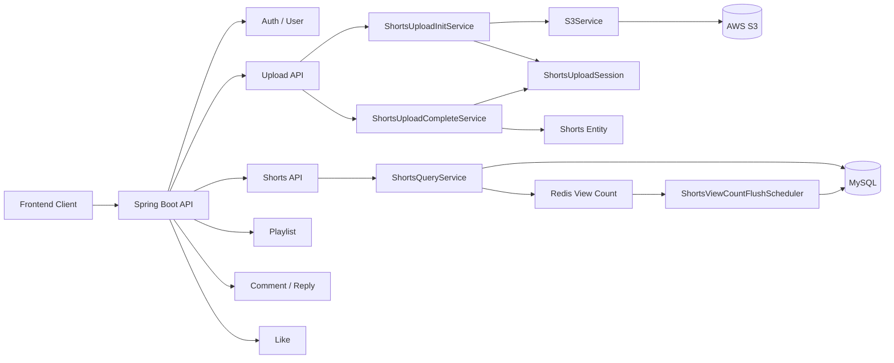
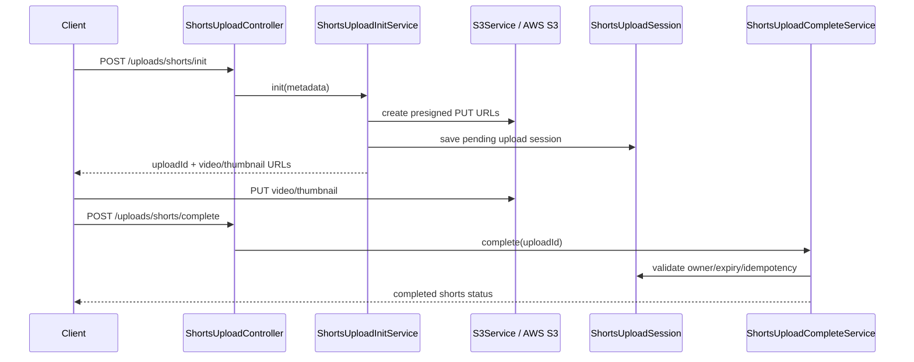
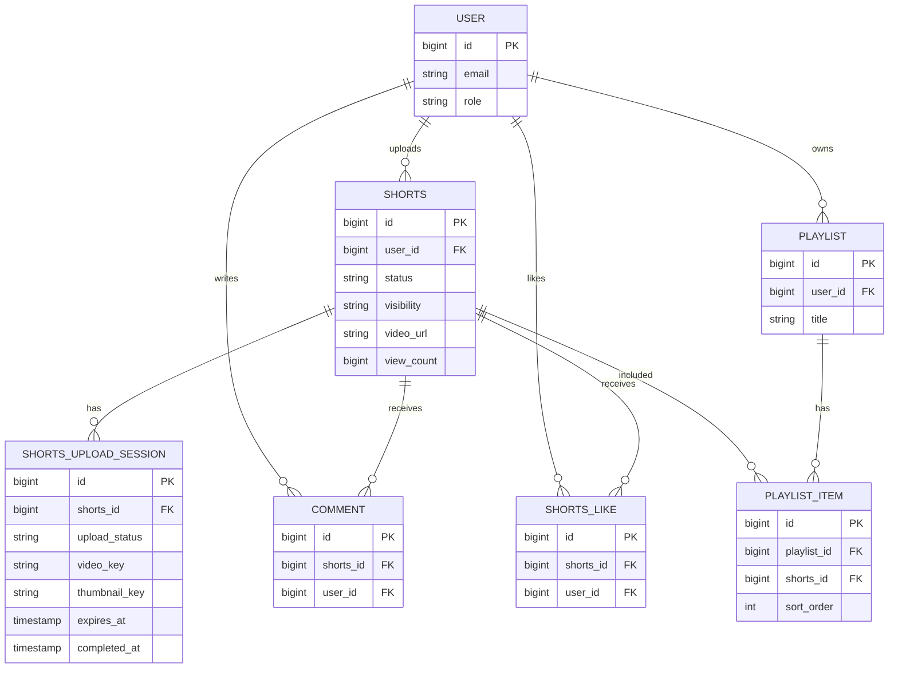

# Shortudy Backend

## 1. 한 줄 요약

S3 Presigned URL 업로드, UploadSession 임시 상태 관리, 공개/검수 상태 분리, Redis 기반 조회수 집계를 구현한 숏폼 학습 플랫폼 백엔드입니다.

### 빠른 검토 순서

1. [핵심 코드 바로가기](#5-핵심-코드-바로가기)에서 S3 Presigned URL, UploadSession, 상태 분리, Redis 조회수 집계를 먼저 확인합니다.
2. [아키텍처](#6-아키텍처)에서 업로드 수명주기와 조회수 flush 흐름을 확인합니다.
3. [한계와 개선점](#12-한계와-개선점)에서 운영 지표 API처럼 근거가 부족한 범위를 확인합니다.

## 2. 내가 맡은 역할

팀 프로젝트 중 백엔드/인프라 중심 담당 범위입니다.

- S3 Presigned URL 기반 direct upload 흐름
- `ShortsUploadSession` 기반 임시 업로드 상태 관리
- 업로드 완료 처리와 Shorts 게시 상태 분리
- `PENDING / AI_CHECK / PUBLISHED / REJECT` 검수 상태와 `PUBLIC / PRIVATE` 공개 상태 분리
- Redis 기반 unique view, pending view count, DB flush
- MySQL, Redis, S3 환경변수 기반 실행 구성

## 3. 문제 정의

숏폼 영상 업로드는 파일 전송과 DB 게시 상태를 한 트랜잭션처럼 다루기 어렵습니다. 사용자가 S3에 직접 업로드하는 동안 백엔드는 임시 세션과 완료 API를 통해 상태를 추적해야 하며, 조회수처럼 자주 바뀌는 값은 매 요청마다 DB에 쓰면 비용과 경합이 커집니다.

## 4. 핵심 기능

- S3 Presigned URL 발급
- 업로드 초기화, 완료, 상태 조회 API
- UploadSession 만료/완료 상태 관리
- 업로드 상태와 숏츠 공개/검수 상태 분리
- Redis unique view TTL과 pending count 집계
- Redis pending view count를 DB view count와 병합
- 스케줄러 기반 Redis view count flush

## 5. 핵심 코드 바로가기

| 보여줄 코드 | 링크 | 이유 |
| --- | --- | --- |
| S3 Presigned URL 발급 | [`S3Service.getPresignedUrl`](https://github.com/minji0828/wantbehelp-3rd-LXP/blob/refactor/shorts/src/main/java/com/example/shortudy/global/config/S3Service.java#L31-L52) | 제한된 PUT 요청을 5분 URL로 서명합니다. |
| 업로드 초기화 | [`ShortsUploadInitService.init`](https://github.com/minji0828/wantbehelp-3rd-LXP/blob/refactor/shorts/src/main/java/com/example/shortudy/domain/upload/service/ShortsUploadInitService.java#L65-L141) | 영상/썸네일 URL 발급, pending Shorts 생성, uploadId 반환 흐름입니다. |
| UploadSession | [`ShortsUploadSession`](https://github.com/minji0828/wantbehelp-3rd-LXP/blob/refactor/shorts/src/main/java/com/example/shortudy/domain/upload/entity/ShortsUploadSession.java#L10-L200) | 임시 상태, S3 URL, 만료, 완료 시각을 Shorts와 분리합니다. |
| 업로드 완료 처리 | [`ShortsUploadCompleteService.complete`](https://github.com/minji0828/wantbehelp-3rd-LXP/blob/refactor/shorts/src/main/java/com/example/shortudy/domain/upload/service/ShortsUploadCompleteService.java#L43-L84) | owner/만료/idempotency를 확인하고 서버가 S3 URL을 확정합니다. |
| 업로드 API | [`ShortsUploadController`](https://github.com/minji0828/wantbehelp-3rd-LXP/blob/refactor/shorts/src/main/java/com/example/shortudy/domain/upload/controller/ShortsUploadController.java#L41-L86) | init/complete/status polling REST 진입점입니다. |
| 공개/검수 상태 분리 | [`Shorts.status/visibility`](https://github.com/minji0828/wantbehelp-3rd-LXP/blob/refactor/shorts/src/main/java/com/example/shortudy/domain/shorts/entity/Shorts.java#L90-L96) | 업로드 완료가 곧 공개를 의미하지 않도록 상태를 분리합니다. |
| 상태 전이 보호 | [`Shorts.changeStatus/changeVisibility`](https://github.com/minji0828/wantbehelp-3rd-LXP/blob/refactor/shorts/src/main/java/com/example/shortudy/domain/shorts/entity/Shorts.java#L191-L222) | 검수 상태와 공개 상태 변경을 entity 메서드에 모았습니다. |
| public feed filtering | [`ShortsRepository`](https://github.com/minji0828/wantbehelp-3rd-LXP/blob/refactor/shorts/src/main/java/com/example/shortudy/domain/shorts/repository/ShortsRepository.java#L59-L91) | 공개 feed는 `PUBLISHED + PUBLIC` 기준으로 필터링합니다. |
| Redis 조회수 저장소 | [`RedisShortsViewCountRepository`](https://github.com/minji0828/wantbehelp-3rd-LXP/blob/refactor/shorts/src/main/java/com/example/shortudy/domain/shorts/view/repository/RedisShortsViewCountRepository.java#L17-L75) | pending count와 unique view key를 Redis로 관리합니다. |
| unique view 처리 | [`ShortsViewCountService.increaseViewCount`](https://github.com/minji0828/wantbehelp-3rd-LXP/blob/refactor/shorts/src/main/java/com/example/shortudy/domain/shorts/view/service/ShortsViewCountService.java#L18-L41) | 24시간 TTL 기반 unique visitor만 조회수 증가에 반영합니다. |
| Redis -> DB flush | [`ShortsViewCountService.flushViewCounts`](https://github.com/minji0828/wantbehelp-3rd-LXP/blob/refactor/shorts/src/main/java/com/example/shortudy/domain/shorts/view/service/ShortsViewCountService.java#L44-L56) | Redis pending count를 DB에 반영한 뒤 pending 상태를 정리합니다. |
| 조회 결과 병합 | [`ShortsQueryService.enrich`](https://github.com/minji0828/wantbehelp-3rd-LXP/blob/refactor/shorts/src/main/java/com/example/shortudy/domain/shorts/service/ShortsQueryService.java#L142-L176) | DB view count와 Redis pending count를 합쳐 near-real-time 조회수를 제공합니다. |
| 운영 지표 API | 미확인 | 현재 checkout에서 관련 코드를 확인하지 못해 구현 완료로 주장하지 않습니다. |

## 6. 아키텍처





## 7. ERD



## 8. API 명세

| Domain | 대표 경로 |
| --- | --- |
| Auth/User | `/api/v1/auth`, `/api/v1/users` |
| Shorts | `/api/v1/shorts` |
| Upload | `/api/v1/uploads/shorts` |
| Playlist | `/api/v1/playlists` |
| Comment/Reply | `/api/v1/comments`, `/api/v1/replies` |
| Like | `/api/v1/shorts/*/likes` |
| Keyword/Category/Recommendation | controller 코드 기준 확인 |

## 9. 실행 방법

```bash
cp .env.example .env
docker compose up -d db redis
set -a && source .env && set +a
./gradlew bootRun
```

## 10. 테스트/검증

```bash
./gradlew test
```

대표 테스트:

- [`ShortsLikeIntegrationTest.java`](src/test/java/com/example/shortudy/domain/like/ShortsLikeIntegrationTest.java)
- [`ShortsLikeControllerTest.java`](src/test/java/com/example/shortudy/domain/like/Controller/ShortsLikeControllerTest.java)
- [`ShortsLikeServiceTest.java`](src/test/java/com/example/shortudy/domain/like/service/ShortsLikeServiceTest.java)

부하테스트 스크립트는 현재 checkout에서 확인되지 않았습니다. 수행 근거가 있는 테스트만 기록합니다.

## 11. 트러블슈팅

| 문제 | 원인 | 해결 | 배운 점 |
| --- | --- | --- | --- |
| 업로드 완료와 실제 S3 객체 상태 불일치 가능 | Direct upload는 클라이언트 완료 요청에 의존 | UploadSession을 만들고 완료 API에서 owner/만료/idempotency 검증 | 파일 전송과 게시 상태는 분리해야 함 |
| 업로드 완료가 곧 공개가 되는 문제 | 파일 존재와 콘텐츠 검수는 다른 도메인 상태 | `status`와 `visibility` 분리 | 업로드 파이프라인과 노출 정책을 섞으면 안 됨 |
| 조회수 DB write 경합 | 매 요청마다 DB update 시 쓰기 부하 증가 | Redis pending count + scheduled flush | 강한 정합성이 필요 없는 데이터는 반영 전략을 분리할 수 있음 |
| 운영 지표 API 근거 부족 | 현재 branch에서 관련 코드 미확인 | README에서는 구현 완료로 주장하지 않음 | 포트폴리오 README는 확인 가능한 코드만 링크해야 함 |

## 12. 한계와 개선점

- 운영 지표 API는 현재 checkout에서 확인하지 못했습니다. 코드가 다른 branch/module에 있다면 별도 근거 링크가 필요합니다.
- S3 실제 객체 존재 검증은 S3 Event Notification 또는 HEAD Object 확인으로 보강할 수 있습니다.
- Redis pending count flush 실패 시 재시도/보상 전략을 더 명확히 문서화해야 합니다.
- 테스트는 좋아요 도메인 중심으로 확인되며 upload/Redis 조회수 도메인 테스트 보강이 필요합니다.
- TODO/deprecated marker가 일부 controller/service에 남아 있어 실제 운영 전 정리가 필요합니다.
